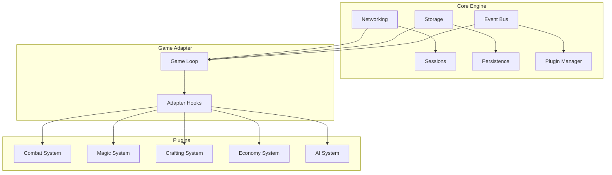

# Stratamu Game Engine

Stratamu is a modular, extensible **game engine framework** for building **MUD/MUSH/MOO-style multiplayer text games**.  
It provides a robust foundation for **networking, storage, plugins, and core gameplay logic**, all organized in a modern **TypeScript monorepo structure**.

---

## 🌐 Architecture Overview

- **Core Engine (`core/`)**
  - Networking (connections, sessions, message passing)
  - Storage (persistence layer, DB adapters)
  - Event system & plugin loader
  - Core utilities (logging, config, scheduler)

- **Game Adapters (`adapters/`)**
  - Define the base gameplay loop and mechanics for a _type_ of game
    - MUD (combat-oriented, dungeon-style gameplay)
    - MUSH (roleplay + storytelling focus)
  - Provide hooks for plugins to extend

- **Plugins (`plugins/`)**
  - Add features/systems that plug into adapters
    - Combat (turn-based or real-time)
    - Magic (mana, spells, abilities)
    - Crafting (recipes, resources)
    - Economy (currency, shops, trade)
    - AI (NPC behaviors)
  - Reusable across adapters

- **Shared Libraries (`shared/`)**
  - Common utilities (parsers, string formatters, DSLs)
  - Types and logging
  - CLI & scaffolding tools
  - Test helpers

---

## 🔄 Flow Chart



## 📁 Folder Structure

```text
stratamu/
├── packages/
│   ├── core-engine/
│   │   ├── src/
│   │   │   └── index.ts
│   │   ├── networking/      # Connections, sessions, protocols
│   │   ├── storage/         # Persistence layer (DB adapters, files)
│   │   └── engine-manager/  # Core game loop, event system, plugin loader
│   │
│   ├── adapters/
│   │   ├── mud/             # Combat-oriented, dungeon-style gameplay
│   │   └── mush/            # Roleplay and storytelling focus
│   │
│   ├── plugins/
│   │   ├── combat/          # Combat mechanics
│   │   ├── magic/           # Magic system
│   │   ├── economy/         # Shops, currency, trade
│   │   └── ai/              # NPC AI, behaviors
│   │
│   └── shared/
│       ├── utils/           # Utility functions, parsers
│       ├── types/           # Type definitions
│       └── logging/         # Logging system
│
├── docs/
│   ├── architecture.md
│   ├── flowchart.md
│   └── plugins.md
│
├── examples/
│   ├── simple-mud/
│   └── mush-rp/
│
├── package.json
├── turbo.json (or nx.json)
└── tsconfig.json
```
